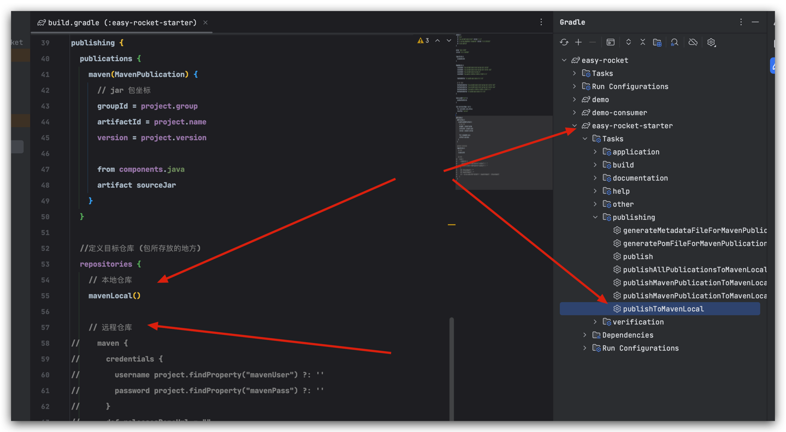

希望大哥能提一提 pr

pr 流程 基于 develop 拉迭代分支，pr 目标分支也需要是 develop

遵循 GNU GENERAL PUBLIC LICENSE 开源协议。

开源、配置简单、开箱即用

有构建 start 信息，可以在自己的私服引入打好的包，依赖到项目即可开心的使用了。
逻辑有待优化，后续也可能会把构建好的 start 放到 maven 仓库（主要自己太懒了 懒得看教程 --- 以连夜支持）

本地发布之后直接引入， 私服发布后，需要配置 maven 仓库地址
```groovy
implementation 'easy.rocket:easy-rocket-starter:0.0.1-SNAPSHOT'
```
修改 easy-rocket-starter 下 build.gradle 文件的 version 即可修改版本号


配置信息解释

```yaml
# name srv 地址 可以用 rocket mq 的方式指定
# see org.apache.rocketmq.common.utils.NameServerAddressUtils#getNameServerAddresses
user.name_srv=192.168.10.150:9876
rocketmq.name-srv-addr=${user.name_srv}
# 系统运行环境 必须指定 此处就是 topic 的前缀 所有 topic 按照运行环境区分
# 不指定会尝试获取 spring.profiles.active
rocketmq.env=dev
# producer 组
rocketmq.producer-group=dev

# rocket mq 的 name space 感觉暂时用不上
#（maybe 是我接触的项目还太小，没有用到这种 namespace 的方式隔离）
#rocketmq.name-space=rocket_test

# 是否开启无需消息推送
rocketmq.producer.normal=true
@是否开启顺序消息推送
rocketmq.producer.order=true

# 监听器 用于真正的推送
#rocketmq.listener=true
# 是否支持在 spring tx 事务执行完毕后推送
rocketmq.transactional.listener=true

# fallback 记录（甚至可以不做开关 直接记录？？）
rocketmq.log.fall.back=true
```
